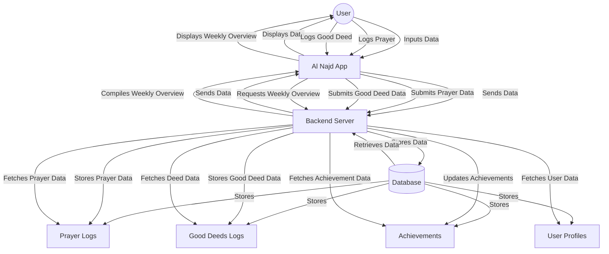

```mermaid
graph TD
    %% External Entities
    User((User)) -->|Inputs Data| App[Al Najd App]
    App -->|Displays Data| User

    %% Processes
    App -->|Sends Data| Backend[Backend Server]
    Backend -->|Stores Data| Database[(Database)]
    Database -->|Retrieves Data| Backend
    Backend -->|Sends Data| App

    %% Data Stores
    Database -->|Stores| PrayerData[Prayer Logs]
    Database -->|Stores| DeedData[Good Deeds Logs]
    Database -->|Stores| AchievementData[Achievements]
    Database -->|Stores| UserData[User Profiles]

    %% Data Flows
    User -->|Logs Prayer| App
    User -->|Logs Good Deed| App
    App -->|Submits Prayer Data| Backend
    App -->|Submits Good Deed Data| Backend
    Backend -->|Stores Prayer Data| PrayerData
    Backend -->|Stores Good Deed Data| DeedData
    Backend -->|Updates Achievements| AchievementData
    App -->|Requests Weekly Overview| Backend
    Backend -->|Fetches User Data| UserData
    Backend -->|Fetches Prayer Data| PrayerData
    Backend -->|Fetches Deed Data| DeedData
    Backend -->|Fetches Achievement Data| AchievementData
    Backend -->|Compiles Weekly Overview| App
    App -->|Displays Weekly Overview| User
```
