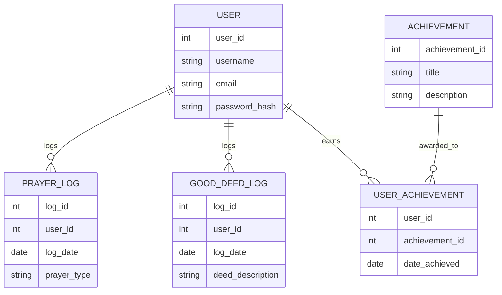

```mermaid
erDiagram
    USER {
        int user_id
        string username
        string email
        string password_hash
    }
    PRAYER_LOG {
        int log_id
        int user_id
        date log_date
        string prayer_type
    }
    GOOD_DEED_LOG {
        int log_id
        int user_id
        date log_date
        string deed_description
    }
    ACHIEVEMENT {
        int achievement_id
        string title
        string description
    }
    USER_ACHIEVEMENT {
        int user_id
        int achievement_id
        date date_achieved
    }
    USER ||--o{ PRAYER_LOG : logs
    USER ||--o{ GOOD_DEED_LOG : logs
    USER ||--o{ USER_ACHIEVEMENT : earns
    ACHIEVEMENT ||--o{ USER_ACHIEVEMENT : awarded_to
```
