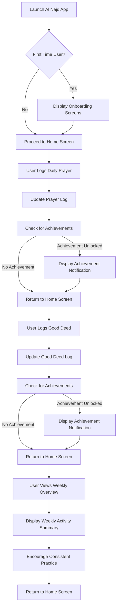

# App Journey Flow Chart

```mermaid
graph TD
    A[Launch Al Najd App] --> B{First Time User?}
    B -- Yes --> C[Display Onboarding Screens]
    B -- No --> D[Proceed to Home Screen]
    C --> D
    D --> E[User Logs Daily Prayer]
    E --> F[Update Prayer Log]
    F --> G[Check for Achievements]
    G -- Achievement Unlocked --> H[Display Achievement Notification]
    G -- No Achievement --> I[Return to Home Screen]
    H --> I
    I --> J[User Logs Good Deed]
    J --> K[Update Good Deed Log]
    K --> L[Check for Achievements]
    L -- Achievement Unlocked --> M[Display Achievement Notification]
    L -- No Achievement --> N[Return to Home Screen]
    M --> N
    N --> O[User Views Weekly Overview]
    O --> P[Display Weekly Activity Summary]
    P --> Q[Encourage Consistent Practice]
    Q --> R[Return to Home Screen]
```
