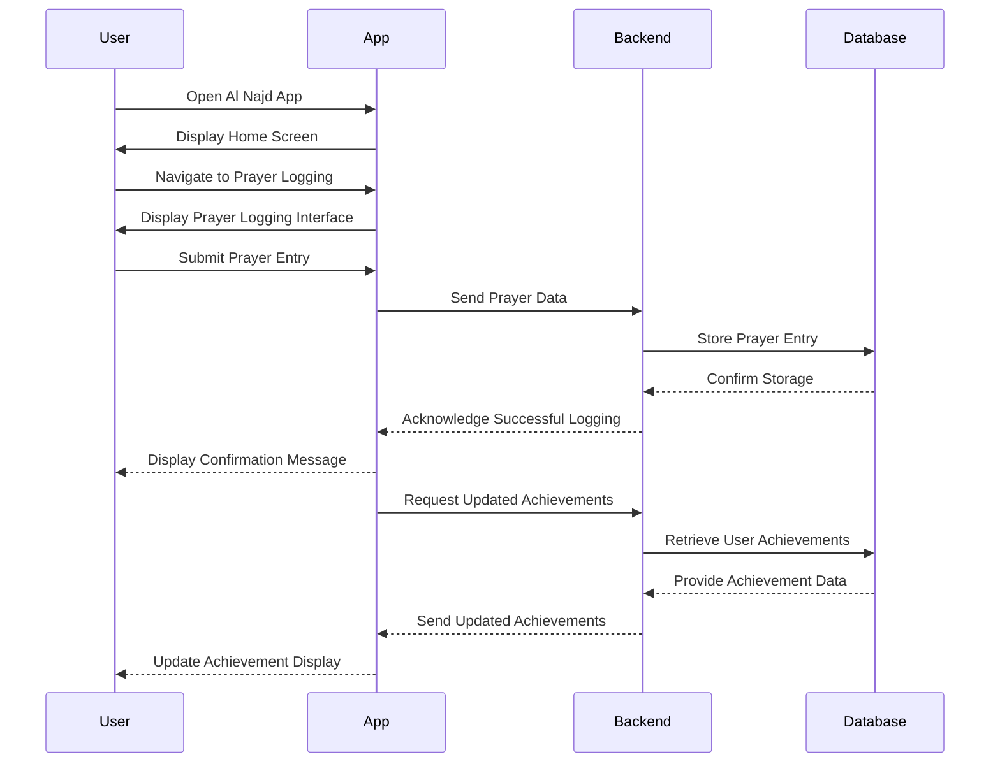

```mermaid
sequenceDiagram
    participant User
    participant App
    participant Backend
    participant Database

    User->>App: Open Al Najd App
    App->>User: Display Home Screen
    User->>App: Navigate to Prayer Logging
    App->>User: Display Prayer Logging Interface
    User->>App: Submit Prayer Entry
    App->>Backend: Send Prayer Data
    Backend->>Database: Store Prayer Entry
    Database-->>Backend: Confirm Storage
    Backend-->>App: Acknowledge Successful Logging
    App-->>User: Display Confirmation Message
    App->>Backend: Request Updated Achievements
    Backend->>Database: Retrieve User Achievements
    Database-->>Backend: Provide Achievement Data
    Backend-->>App: Send Updated Achievements
    App-->>User: Update Achievement Display
```
